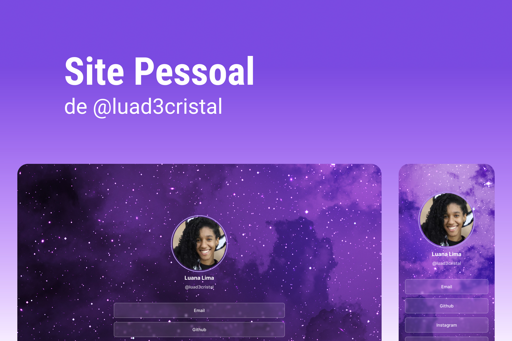

<h1 align="center"> Meu Site Pessoal </h1>

Esse site foi desenvolvido como um cartão de visitas pessoal para ser usado nas redes sociais  

  <a href="#-tecnologias">Tecnologias</a>&nbsp;&nbsp;&nbsp;|&nbsp;&nbsp;&nbsp;
  <a href="#-projeto">Projeto</a>&nbsp;&nbsp;&nbsp;|&nbsp;&nbsp;&nbsp;
  <a href="#-layout">Layout</a>&nbsp;&nbsp;&nbsp;|&nbsp;&nbsp;&nbsp;
  <a href="#memo-licença">Licença</a>

  

 

  

## 🚀Tecnologias

Esse projeto foi desenvolvido com as seguintes tecnologias:

- HTML e CSS
- Git e Github
- Figma

## 💻 Projeto

Esse site é cartão de visitas pessoal.

- [Visite o projeto online](https://luad3cristal.github.io/luanalima.dev)

## :memo: Licença

Esse projeto está sob a licença MIT.